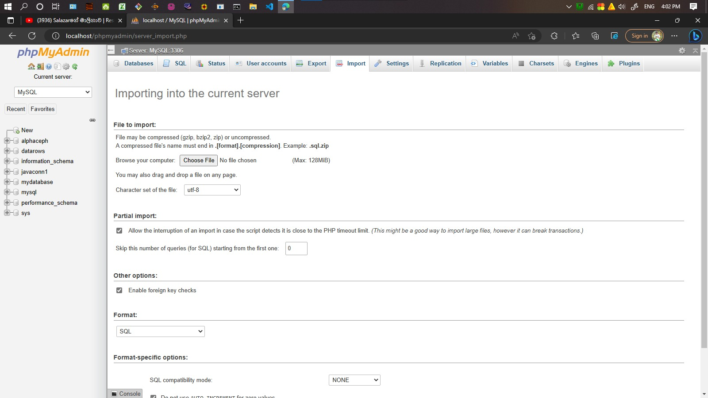
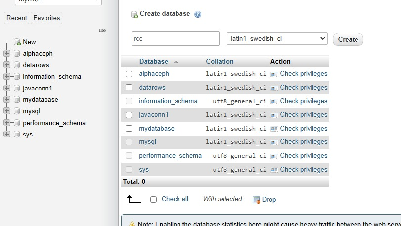
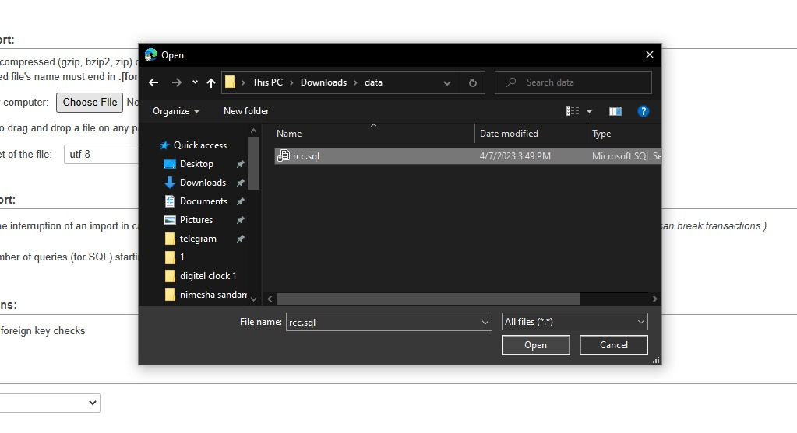
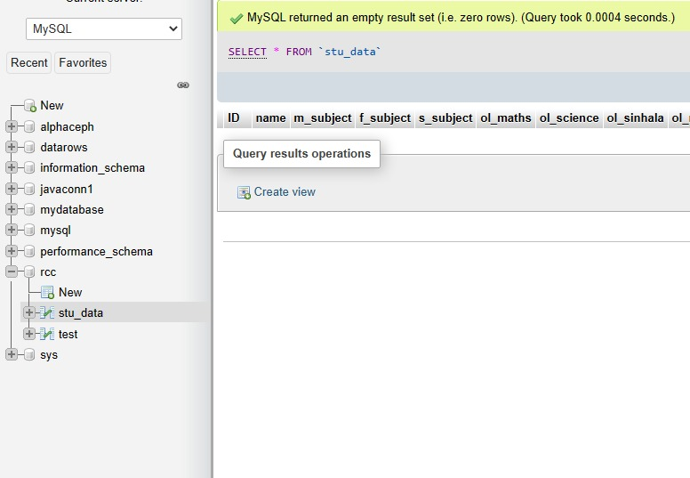

# RCC Tech Student Database

The software designed to search and maintain the data of the students of the technical faculty of Rivisada Central College. Keep the database installed before use

<li>First, install a software like XAMPP, WAMP. After that go to <a href="http://localhost/phpmyadmin/"> localhost php my admin.</a></li>
<li>Go to New and create a new database as RCC</li>
<li>Go to Import and choose File to import all tables and give Go at the bottom of the page.</li>

<table width="100%">
  <tr>
    <td> </td>
    <td> </td>
  </tr>
  <tr>
    <td> </td>
    <td> </td>
  </tr>
</table>  
